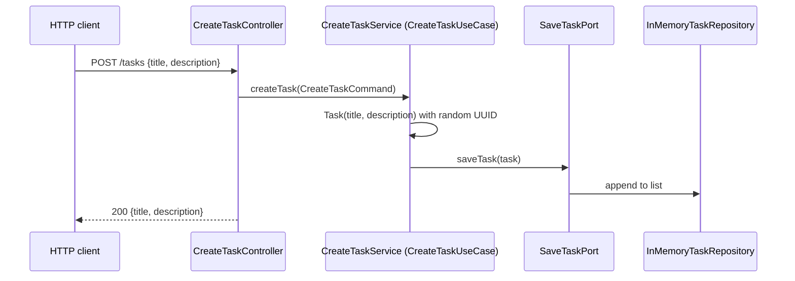

# Tasks REST API

Quarkusaurus exposes a single resource path, `/tasks`, split across two JAX-RS controllers in `src/main/kotlin/de/emaarco/example/adapter/inbound/`. Each controller owns one HTTP verb and delegates straight to an inbound use-case port. Business logic never lives in the controllers.

## Endpoints

| Method | Path | Request body | Response | Controller |
|--------|------|--------------|----------|------------|
| `GET` | `/tasks` | none | `200` JSON array of tasks | `LoadTasksController` |
| `POST` | `/tasks` | `{ "title": string, "description": string }` | `200` JSON echo of the command | `CreateTaskController` |

Both controllers declare `@Path("/tasks")` and `@Produces(MediaType.APPLICATION_JSON)`; the POST controller additionally declares `@Consumes(MediaType.APPLICATION_JSON)`. RESTEasy resolves the two classes onto the same path by HTTP method.

### GET /tasks

Returns every task currently held by the application, in insertion order. A task is serialized from the domain `Task` data class:

```json
[
  { "id": "3f2c...-uuid", "title": "Feed the raptors", "description": "Before lunch" }
]
```

On a fresh instance the list is empty, which the RestAssured test asserts literally as the body `[]`.

### POST /tasks

Accepts a JSON body that is deserialized into `CreateTaskController.TaskRequest`, a Kotlin data class with two non-nullable `String` fields. The controller copies both fields into a `CreateTaskUseCase.CreateTaskCommand`, invokes the use case, and returns `200 OK` with the **command** as the body:

```json
{ "title": "Feed the raptors", "description": "Before lunch" }
```

Two consequences of that design are easy to miss:

- The response does not contain the generated task `id`. Clients that need the id must call `GET /tasks` afterwards, which is exactly what the frontend does.
- The status is `200`, not `201 Created`, and no `Location` header is set.

## Request flow



The GET path is symmetric: `LoadTasksController` calls `LoadTasksUseCase.loadTasks()`, implemented by `LoadTasksService`, which forwards to `LoadTasksPort` and returns the list unchanged. Both services log an info line per call and add no further behaviour.

Controllers obtain their use case via `@Inject lateinit var` field injection, while services receive their outbound ports through constructor injection. Both styles resolve through Quarkus Arc because the `kotlin-allopen` plugin opens `@Path` and `@ApplicationScoped` classes (see `build.gradle.kts`).

## Validation and error behaviour

There is no explicit validation layer. Neither controller nor service checks for blank titles, length limits, or duplicates, and the domain `Task` accepts any strings. The `maxlength` and `required` constraints exist only in the browser form, so a direct API call can create a task with an empty title.

Because `TaskRequest` uses non-nullable Kotlin properties and the project depends on `jackson-module-kotlin`, a body that omits `title` or `description` fails during deserialization before the controller method runs. The resulting error is produced by the framework's default Jackson handling rather than by application code; the application defines no exception mappers.

Nothing in the API is authenticated or authorized, and `application.properties` is empty, so all Quarkus HTTP defaults apply (port 8080, no CORS configuration).

## Manual testing

The `.bruno/` directory contains a Bruno collection with `Load tasks.bru` and `Create Task.bru`, which target `http://localhost:8080/tasks` and mirror the shapes above. The `Create Task` request sends a `Content-Type: application/json` header with a title and description body.

## Related pages

- [Hexagonal Architecture](../architecture/hexagonal-architecture.md) explains why controllers only see use-case interfaces.
- [Task Domain and In-Memory Persistence](../architecture/task-domain-and-persistence.md) covers id generation and storage lifetime.
- [Dino To-Do Frontend](../frontend/dino-todo-ui.md) is the primary consumer of this API.
- [Test Strategy](../testing/test-strategy.md) describes the RestAssured tests that pin the GET contract.
