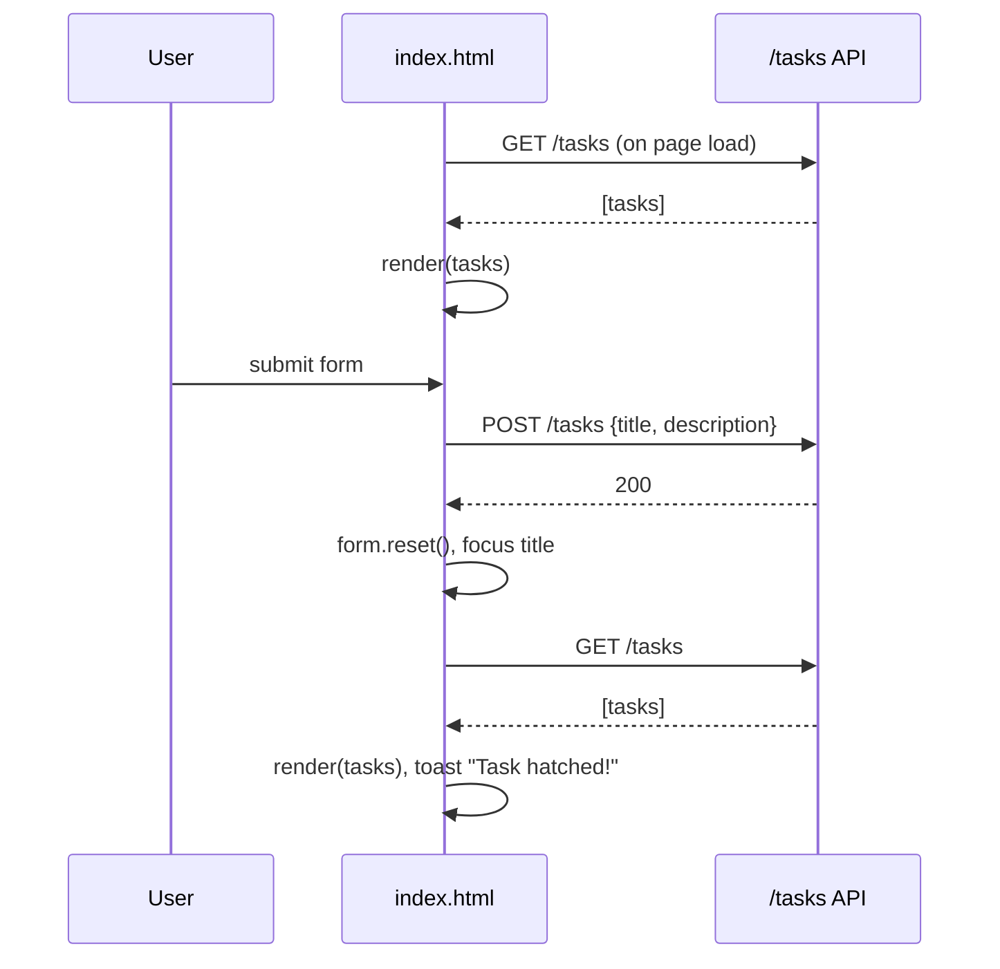

# Dino To-Do Frontend

Quarkusaurus ships its own user interface inside the application jar. The page is a single file, `src/main/resources/META-INF/resources/index.html`, with inline CSS and inline JavaScript. Quarkus serves anything under `META-INF/resources/` as static content, so the page is reachable at `http://localhost:8080/` with no build step, bundler, or separate frontend server.

## Page structure

The page has three interactive regions, all identified by stable ids and labels that the Playwright tests also rely on:

- **The hatchery** is a `<form id="task-form">` with a `Title` input (`required`, `maxlength="120"`), a `Description` textarea, and a submit button labelled "🦴 Hatch it!".
- **The nest** is a `<ul id="task-list">` plus a `` badge showing the number of tasks.
- **A toast** (`#toast`) that slides in for about two seconds to confirm or report an outcome.

## Talking to the API

All requests go to the relative path `/tasks`, so the page works on whatever host and port the Quarkus server is bound to, including Conductor's per-workspace ports.

**Loading.** On page load `loadTasks()` fetches `/tasks`, and `render()` writes the count and one `<li class="task">` per task. When the list is empty it shows a placeholder row inviting the user to create the first task.

**Creating.** The submit handler prevents the default form post, trims both fields, and silently returns if the title is blank. It disables the submit button, sends a JSON `POST` with `title` and `description`, and on success resets the form, refocuses the title field, re-fetches the list, and shows the "Task hatched!" toast. The button is re-enabled in a `finally` block so a failure never leaves the form stuck.

The page never uses the POST response body. Because the API echoes the command rather than the saved task, the follow-up `GET` is the only way the UI learns the new task's id and position. See [Tasks REST API](../api/tasks-rest-api.md).

## Rendering and safety

Task titles and descriptions are inserted with `innerHTML`, but every value passes through `escapeHtml()`, which replaces `&`, `<`, `>`, and `"`. A description is only rendered when it is non-empty. This is the only defence against script injection, since the API itself stores strings verbatim.

## Error behaviour

Both fetch paths treat any non-2xx status as an error by throwing on `!res.ok`:

| Situation | User feedback |
|-----------|---------------|
| `GET /tasks` fails or the server is unreachable | Toast "Couldn't reach the jungle 🌋" |
| `POST /tasks` fails | Toast "The egg cracked 🥚💥"; form keeps its input |

Errors are also logged to the browser console. There is no retry and no differentiation between network and HTTP errors.

## Validation split

Client-side constraints (`required`, `maxlength="120"`, trimming) exist only in this page. The API performs no validation, so anything bypassing the form can create tasks the UI would have rejected.

## Tests

The Playwright suite in `e2e/tests/app.spec.js` drives this page as a user would: it checks the title, heading, `Title` label, and hatch button are visible, then fills the form, submits, and expects the new task to appear in the nest and the title field to be cleared. See [Test Strategy](../testing/test-strategy.md).

## Related pages

- [Tasks REST API](../api/tasks-rest-api.md)
- [Test Strategy](../testing/test-strategy.md)
- [Conductor Workspaces](../operations/conductor-workspaces.md) for why relative URLs matter.
